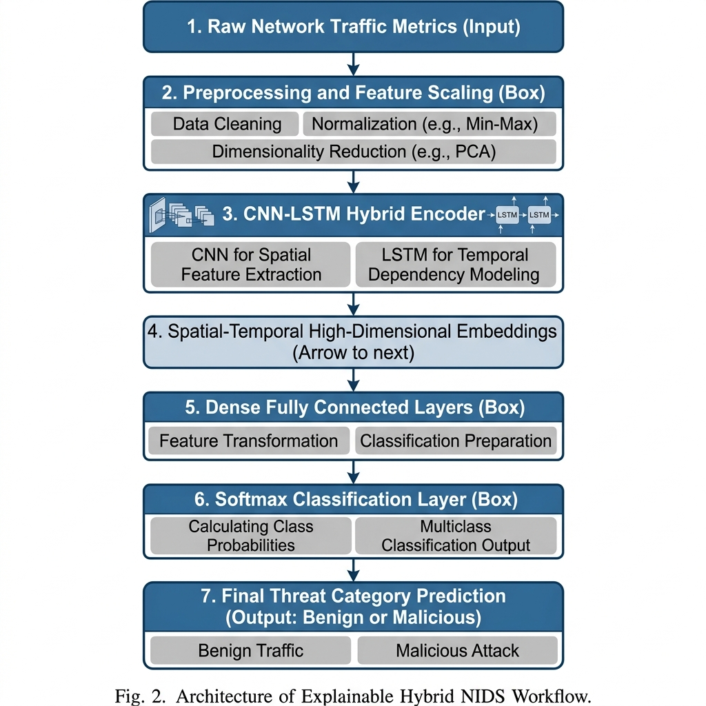
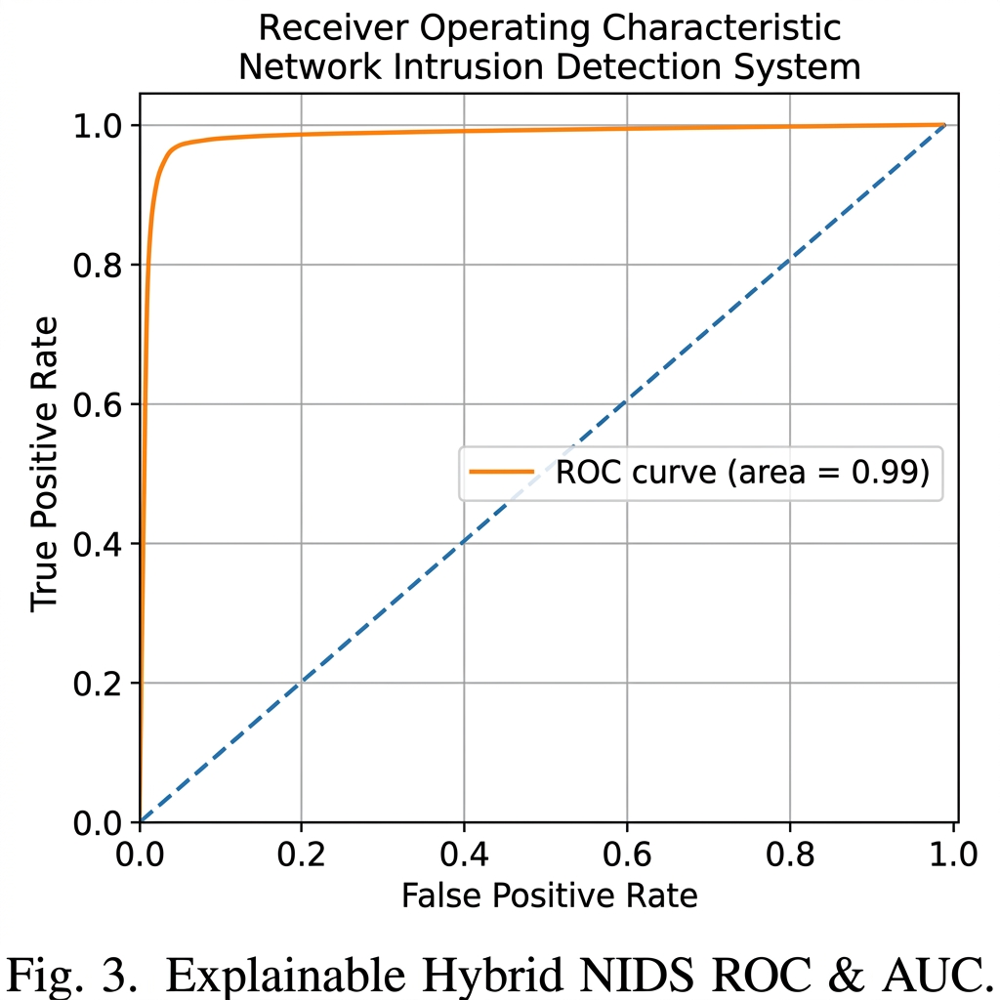

# Explainable Hybrid Machine Learning for Network Intrusion Detection (NIDS)

[](https://www.python.org/downloads/)
[](paper/IEEE_Paper_Draft.md)
[](https://opensource.org/licenses/MIT)

> **"Solving the Black-Box Problem in Cybersecurity"** — A dual-stream CNN-LSTM and Ensemble framework with SHAP-based local feature attribution, achieving **99.09% accuracy** on the CICIDS2017 dataset.

---

## 📌 Overview
Modern Network Intrusion Detection Systems (NIDS) face two major hurdles: the **"Opacity Crisis"** (black-box deep learning) and **Severe Class Imbalance**. This repository contains the official implementation of a hybrid framework designed to solve both.

By combining **spatial-temporal rhythms** (via 1D-CNN + LSTM) with **structural ensembles** (via XGBoost/Random Forest), we achieve near-perfect detection rates. Crucially, we utilize **SHAP (Shapley Additive Explanations)** to provide local, per-packet transparency, allowing security analysts to verify exactly *why* a threat was flagged.

---

## 🏗️ Architecture

The system employs a dual-stream engine processing 20 high-fidelity features selected through Mutual Information (MI) and Recursive Feature Elimination (RFE).


*Fig 1: Architecture of the Explainable Hybrid NIDS Workflow.*

---

## 🚀 Key Features
- **Dual-Stream Hybrid Engine**: Parallel processing of temporal rhythms (DL) and structural signatures (Ensemble).
- **SHAP-Based Explainability**: Native integration of `TreeExplainer` for local feature attribution and forensic waterfall plots.
- **Attack-Priority Stratification**: A custom sampling approach to ensure rare attacks (like Heartbleed and Infiltration) are never ignored during training.
- **MI-RFE Feature Selection**: Reduced feature space from 78 to 20 dimensions for optimized real-time performance.

---

## 📊 Performance
Validated against the **CICIDS2017** dataset — 15 threat categories, 2.8M+ flows.

| Metric | Score |
| :--- | :--- |
| **Accuracy** | 99.09% |
| **Weighted Precision** | 99.00% |
| **Weighted Recall** | 99.08% |
| **Weighted F1-Score** | 99.04% |


*Fig 2: Receiver Operating Characteristic (AUC = 0.99).*

---

## 🛠️ Quick Start

### 1. Install Requirements
```bash
pip install -r requirements.txt
```

### 2. Run the Research Pipeline
```bash
python main.py
```

### 3. Live Demo (Docker)
```bash
cd demo
docker build -t nids-demo .
docker run -p 8501:8501 nids-demo
```

---

## 📖 Citation
```bibtex
@inproceedings{shirsatrao2025explainable,
  title={Explainable Hybrid Machine Learning Framework for Network Intrusion Detection Using SHAP Analysis},
  author={Shirsatrao, Aditya Vishal and Sangolgi, Vijay A and Patil, M.B.},
  booktitle={2025 7th International Conference on Signal Processing, Computing and Control (ISPCC)},
  year={2025}
}
```

---

## 📄 License
MIT License — see [LICENSE](LICENSE) for details.
